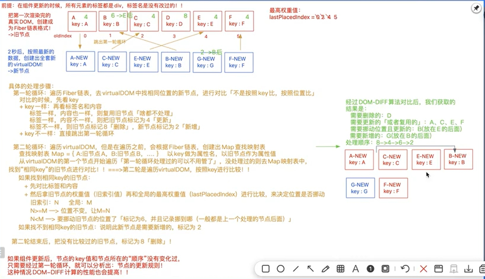

### DOM-DIFF或者 是Fiber算法

DOM-DIFF主要就是在组件更新的时候，实现差异化的更新，而不是整体全部更新，以此来优化组件渲染的速度，提高性能

### 16及以前 和 17及以后得 DOM-DIFF算法

1.  在16及以前：新老虚拟DOM进行对比
2.  在17及以后： 老的DOM会构建出Fiber链表，拿最新创建的虚拟DOM和Fiber链表做对比

### DOM-DIFF的优化原则

- 深度优先原则 
- 同级对比 
- 不同类型的元素，会产生出不同的结构：销毁老结构，创建新结构 
- 可以通过key标识移动元素：如果不设置key，则默认元素的‘索引’就是key 

1.  处理规则
    key和类型都相同： 
        更新且复用老的节点。设置标识值Update（4）  
    key和类型 只要有一个不相同：  
        删除老的；Deletion（8）  
        插入新的 。Placement（2）  
        插入并更新，也就是拖动位置 PlacementAndUpdate(6)

2. 详细步骤 
 
